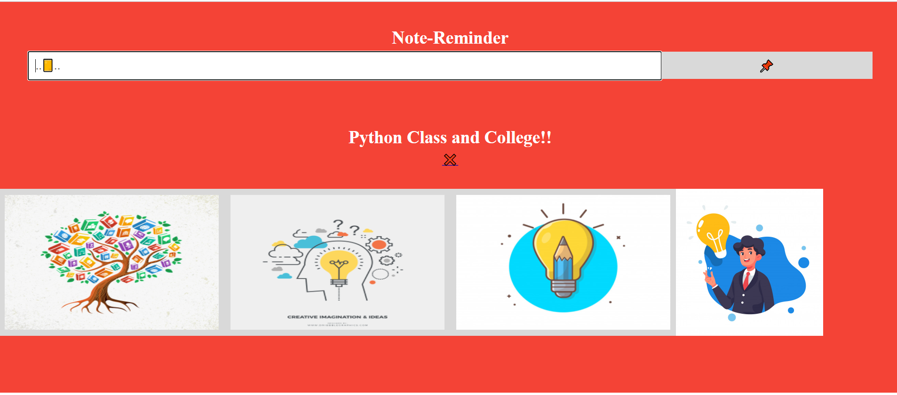

# Todo
An Flask based fun webApp for todo listing 

## Getting Started
 Flask is a Python-based free and open-source web framework 
  <a href="https://flask.palletsprojects.com/">Start Your journey from here!</a> 
 Also if you like then Don't Forget to give a star!
🌟✨

so if You guys are intrested plese let me know clone it and became a colaborator.

## Way to help
Find me!
Git clone (using this command or download locally )
And run the command python app.py runserver
learn few docomentation of flask and push your code here____>>>>>>______

# Thank You :)❤️❤️
